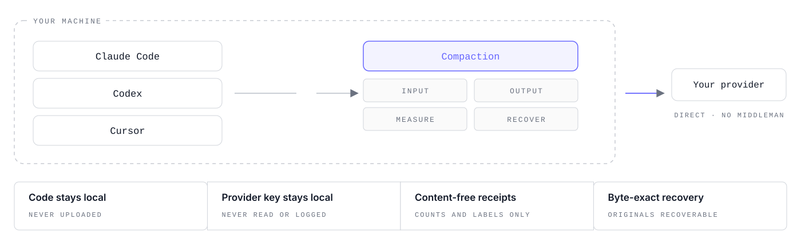

<div align="center">

<!-- Banner hosted on the public R2 bucket so it renders on GitHub AND the npm package page. -->


# Make coding agents resend less

[](https://www.npmjs.com/package/@compaction/cli)
[](LICENSE)

[Install](#install) · [How it works](#how-it-works) · [What you get](#what-you-get) ·
[Proof](#proof) · [Supported tools](#supported-tools) · [Plans](#open-and-community-plans) ·
[Privacy](#privacy-and-security)

</div>

---

**Compaction runs underneath Claude Code, Codex, and Cursor. No new editor. No new agent.**

It reduces eligible model visible input before it reaches the provider, shape unnecessary output before generation, and show the result inside the tools you already use.

<picture>
  <source media="(prefers-color-scheme: dark)" srcset="docs/assets/brand/compaction-terminal-dark.gif">
  <source media="(prefers-color-scheme: light)" srcset="docs/assets/brand/compaction-terminal-light.gif">
  
</picture>

This is a real acceptance run through a normal Codex subscription session:

```text
$ codex

↳ compaction · input 8,388,356→7,212,095 (−14%) · output 14,393→10,795 (−25%, est.) · +~3.08m · full apply
```

The input arrow is measured before→after evidence. The output before value is a calibrated counterfactual, so it stays marked `est.`. `+~3.08m` is the estimated equivalent active agent time preserved at the observed workload consumption rate. This is not a claim about a provider's hidden quota or rate limit formula.

- **Output reduction is applied from the first eligible run.** No account required
- **Input reduction is separately supported with a free account.** We have validated ~48–50% less billed input on uncached API sessions and ~5–10% on cached sessions (provider reported)
- **Local by default.** Compaction processes request content on your machine and sends it only to the provider you already use. It does not upload prompts, code, or responses to any outside service, and never reads, stores, or logs your provider key

⭐ **If Compaction saves you tokens, please star the repo.**

## Install

```bash
curl -fsSL https://cli.compaction.dev/install | sh
```

Then run:

```bash
compaction
```

Guided onboarding detects Claude Code, Codex, and Cursor, shows what will change, and writes nothing until you confirm.

Or install from npm:

```bash
npm install -g @compaction/cli
compaction
```

Supported persistent installs use managed updates to keep your version up to date.

<details>
<summary><strong>Other install and update paths</strong></summary>

```bash
curl -fsSL https://cli.compaction.dev/install | less
curl -fsSL https://cli.compaction.dev/install | sh -s -- --dry-run

npx @compaction/cli init
npx @compaction/cli --help

compaction update --check
compaction update
compaction update --rollback
```

`--channel preview` selects npm's `next` tag; stable uses `latest`. Opt out with `compaction update --auto off` or `COMPACTION_AUTO_UPDATE=0`.

</details>

## How it works

<picture>
  <source media="(prefers-color-scheme: dark)" srcset="docs/assets/brand/compaction-local-architecture-dark.svg">
  <source media="(prefers-color-scheme: light)" srcset="docs/assets/brand/compaction-local-architecture-light.svg">
  
</picture>

1. **Install once.** Run `compaction`
2. **Connect your tools.** Detection is read-only; confirmation is the first write
3. **Keep working exactly as before.** `claude`, `codex`, and Cursor continue to be the tools you use
4. **Compaction optimizes locally.** Output reduction starts on eligible runs. Live history input compaction is supported with a free account
5. **Compaction writes content free receipts.** Token/cache counts and structural labels only, never your prompt, code, or response
6. **You can inspect the result live or later.**
   - `compaction watch` follows new measurable turns live; `--once` shows the latest few and exits.
   - `compaction activity` shows recent run history from the local metrics-only activity store, with filters and JSON output.
   - `compaction status` shows setup/readiness state and includes a small recent-turn summary.

### Two ways to connect

**Subscription.** No API key needed. Claude Code and Codex keep using the subscription you already pay for. On supported runs, subscription sessions can use both input reduction and output reduction.

**API-key.** Traffic goes through the local Gateway. Your key rides straight through to your provider and is never read, stored, or logged by Compaction.

Output shaping is on by default once a tool is connected. Input compaction is explicit and gated. Unsupported request shapes pass through unchanged, and the original request is retained locally for byte exact recovery.

## What you get

- **Output token reduction.** Compaction attaches the shaping policy before eligible generation. If applicable calibration exists, it shows `output ESTIMATED_BEFORE→ACTUAL (−N%, est.)`; otherwise we show `output N/A→ACTUAL (N/A%, est.)`
- **Input token reduction with a free account.** Compaction compresses eligible older history before it is re-sent on supported runs. Output reduction is never metered
- **Content free receipts.** Counts, structural labels, sources, and a short receipt id; never your prompt, code, or response
- **Byte exact recovery.** Every mutated request retains the original locally
- **One product surface.** We keep the user facing model simple: input reduction, output reduction, and evidence

## Proof

Compaction only shows a number when it has evidence for it.

### How Compaction reports savings

What appears depends on what Compaction could actually measure on that run.

Compaction can reduce output tokens but does not change the input:

```text
compaction · observed input 91,472 · output 857→463 (−46%, est.) · basic shaping · id 5f539978
```

Compaction can also reduce model-visible input:

```text
compaction · input 91,472→74,769 (−18%) · output 857→463 (−46%, est.) · full apply · 1.92M/2M left · id 5f539978
```

On an API-key, where the provider bills at a published per token rate, Compaction can also show the estimated price impact:

```text
compaction · input 91,472→74,769 (−18%) · output 857→463 (−46%, est.) · −$0.05 (list price) · full apply · 1.92M/2M left · id 5f539978
```

We use a simple evidence rule:

- **Input before→after is measured.** Both values exist for the same request
- **Actual output is measured.**
- **Output before is estimated.** The same generation cannot simultaneously happen with and without Compaction, so the counterfactual remains marked `est.`
- **If Compaction cannot support a number with evidence, it is shown `N/A`.**

For example:

```text
compaction · observed input 91,472 · output N/A→463 (N/A%, est.) · basic shaping · id 5f539978
```

Here `463` is the observed output. Compaction still reduced the output, but there is no applicable calibration for how large the reduction was, so we leave the missing value missing.

Compaction surfaces the same result in the workflow where possible:

- **Claude Code:** status line
- **Codex:** post turn hook
- **All measurable turns:** `compaction watch`
- **Recent run history:** `compaction activity`
- **Setup and readiness:** `compaction status`

`compaction watch` is the live result feed. `compaction activity` is the historical run view. `compaction status` is the setup/readiness view and only includes a small recent turn summary.

Cursor to our knowledge does not currently expose an inline channel for this result, so its measurable results appear through Compaction's local views.

Set `COMPACTION_RECEIPT_LINE=0` if you want to hide the inline result. Receipts are still written locally.

### What a receipt looks like

<details>
<summary><strong>Illustrative receipt in the real schema</strong></summary>

```json
{
  "receipt_id": "8f4c2f6e-9d1a-4b7e-a301-5c2e9b7d4f10",
  "captured_at": "2026-07-27T09:14:31.402Z",
  "provider": "anthropic",
  "endpoint": "/v1/messages",
  "mode": "apply",
  "request_mutated": true,
  "response_mutated": false,
  "estimated_input_tokens_before": 41210,
  "estimated_input_tokens_after": 21876,
  "estimated_model_visible_input_reduction_percent": 46.9,
  "token_source_before": "local-estimate",
  "token_source_after": "provider-reported",
  "tokens": { "prompt_input": 22012, "output": 412 },
  "applied_components": ["lcm-compaction", "output-shaping"],
  "recovery_id": "8f4c2f6e",
  "content_uploaded": false
}
```

</details>

The original request behind every mutated call is retained locally and can be restored byte-for-byte with:

```bash
compaction gateway recover <id>
```

Without the engine, the same request passes through unchanged. We never describe a pass-through as an apply.

## Supported tools

<table width="100%">
  <thead>
    <tr>
      <th width="18%" align="left">Tool</th>
      <th width="27%" align="left">Route</th>
      <th width="20%" align="left">Output reduction</th>
      <th width="25%" align="left">Input reduction</th>
      <th width="10%" align="left">Counts</th>
    </tr>
  </thead>
  <tbody>
    <tr>
      <td><strong>Claude Code</strong></td>
      <td>transparent local route · subscription or API key</td>
      <td>eligible per-prompt turns</td>
      <td>Community · both routes</td>
      <td>provider-reported</td>
    </tr>
    <tr>
      <td><strong>Codex</strong></td>
      <td>transparent local route · ChatGPT subscription or API key</td>
      <td>eligible per-prompt turns</td>
      <td>Community · both routes</td>
      <td>provider-reported</td>
    </tr>
    <tr>
      <td><strong>Cursor</strong></td>
      <td>session-level instruction</td>
      <td>session-level</td>
      <td>not available on the current integration</td>
      <td>local estimate</td>
    </tr>
  </tbody>
</table>

Input reduction is metered against the Community allowance wherever it runs. Output reduction is never metered.

Also supported for measurement: OpenAI Agents SDK capture and offline trace import (`compaction capture`, `compaction import`).

## Hybrid Engine

The adaptive engine performs input optimization. It is delivered separately from npm and verified by the public client before use.

- **We protect load bearing content first.** Code blocks, commands, file paths, flags, and `file:line` references are locked byte-exact before anything else runs
- **We compact eligible obsolete history.** Old tool output, superseded discussion, and dead ends can be reduced while current task state is preserved
- **It runs on your device.** No Compaction hosted model sits between your agent and the provider
- **You keep the original.** Every compacted request is recoverable byte-for-byte
- **Quality is eval gated.** Effects are task dependent and measured on your own receipts

## Commands

The common commands:

```bash
compaction                                       # guided onboarding
compaction status                                # setup/readiness + recent summary
compaction activity                              # recent run history
compaction watch                                 # live per-turn result feed
compaction watch --once                          # latest few result lines, then exit
compaction usage                                 # Community optimized-input allowance
compaction stop / compaction start               # disable / enable Compaction
```

<details>
<summary><strong>Advanced commands</strong></summary>

```bash
compaction init --connect claude-code
compaction init --connect codex
compaction init --connect cursor
compaction init --connect all

compaction login
compaction engine status
compaction devices
compaction logout

compaction hooks install --tool codex
compaction hooks install --tool cursor
compaction hooks status
compaction hooks uninstall --tool <tool>

compaction gateway start
compaction gateway run -- codex exec --json "…"
compaction gateway run --provider anthropic -- claude
compaction gateway status
compaction gateway verify-cache --provider <id>
compaction gateway recover <recovery_id>
compaction gateway stop

compaction capture claude-code --session <session.jsonl> --out <dir>
compaction import <trace-file> --source <source> --out <dir>
compaction analyze <trace-file>
compaction context add <artifact>
compaction api export --json
```

</details>

`compaction --help` lists the full command reference. Commands that require the adaptive engine say so and exit without pretending to have optimized when it is unavailable.

## Privacy and security

- **Compaction never sends your work content to any outside services.** Prompts, code, and responses stay local to Compaction and go only to the provider you selected
- **Without an account, nothing contacts Compaction services.** Managed installs may check public npm for updates
- **With a free account, only content free account/device/usage/release metadata is exchanged.**
- **Compaction never reads, stores, or logs your provider key.**
- **Nothing is destructive.** Mutated requests retain their original locally for byte exact recovery
- **Hooks are merge not replace, idempotent, and removable.**
- **No `sudo` by default.**

See [SECURITY.md](SECURITY.md) for detailed security information.

## Methodology

Provider reported token counts come from provider usage metadata. Local estimates and costs derived from price tables are labeled as estimates.

An output saving on a user run is a counterfactual estimate derived only from applicable empirical calibration, never an observed twin generation. Without applicable calibration it remains `N/A`.

Effects are provider-, model-, policy-, and task-dependent.

## Contributing

Contributions are welcome. Start with [CONTRIBUTING.md](CONTRIBUTING.md) and please read our [Code of Conduct](CODE_OF_CONDUCT.md).

## License

Licensed under the [Apache License 2.0](LICENSE).

